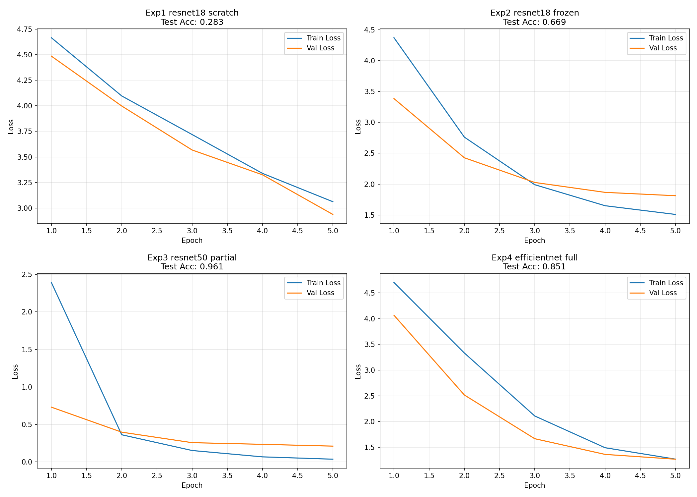
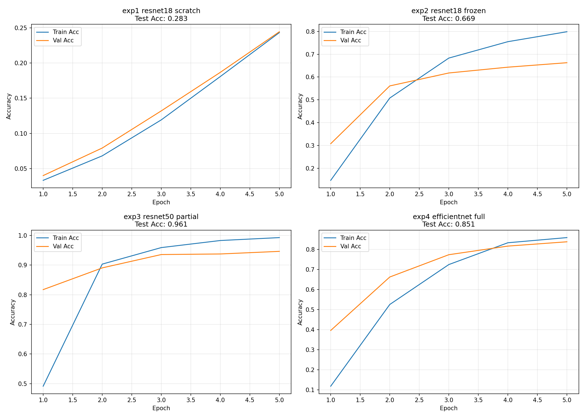
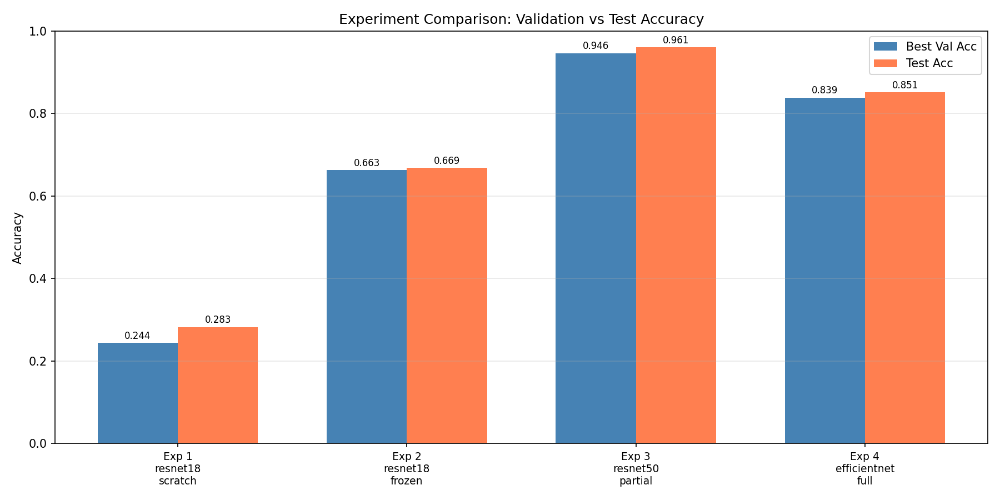

# PokeClassifier

A Pokemon image classifier built with PyTorch and transfer learning. Upload a Pokemon image and the model predicts which of 150 Pokemon it is, showing the top-5 results with Korean names and type information.

## Demo


## Dataset

[7,000 Labeled Pokemon](https://www.kaggle.com/datasets/lantian773030/pokemonclassification) — 150 classes, ~7,000 images (Kaggle)

Dataset split: **70% train / 15% val / 15% test**

## Experiments

Four experiments comparing the effect of **backbone**, **pretrained weights**, and **fine-tuning scope**:

| # | Backbone | Pretrained | Fine-tune | Test Acc | Precision | Recall | F1 |
|---|----------|------------|-----------|----------|-----------|--------|----|
| Exp 1 | ResNet18 | ✗ | All (scratch) | 28.3% | 28.5% | 28.7% | 24.2% |
| Exp 2 | ResNet18 | ✓ | Head only (frozen) | 66.9% | 69.1% | 67.9% | 65.2% |
| Exp 3 | ResNet50 | ✓ | Partial (layer3+4+head) | **96.1%** | **96.5%** | **96.5%** | **96.1%** |
| Exp 4 | EfficientNet-B0 | ✓ | Full fine-tune | 85.1% | 84.0% | 84.6% | 82.1% |

### Key Findings

- **Pretrained weights are critical**: Exp 1 (28.3%) vs Exp 2 (66.9%) — a +38.6%p jump with zero extra inference cost.
- **Larger backbone wins**: ResNet50 partial fine-tuning (96.1%) outperforms EfficientNet-B0 full fine-tuning (85.1%), showing that model capacity matters more than fine-tuning scope for this dataset.
- **Partial fine-tuning can beat full fine-tuning**: Freezing early layers acts as regularization and keeps strong ImageNet features intact, leading to the best result overall.

## Learning Curves

### Loss


### Accuracy


### Experiment Comparison


## Setup

```bash
pip install -r requirements.txt
```

## Usage

### 1. Train all 4 experiments

```bash
python run_experiments.py --data_dir path/to/PokemonData
```

Or train a single experiment:

```bash
python train.py --data_dir path/to/PokemonData --exp exp3_resnet50_partial
```

### 2. Evaluate & generate plots

```bash
python evaluate.py --data_dir path/to/PokemonData
```

### 3. Launch the demo

```bash
streamlit run demo.py
```

Open `http://localhost:8501` in your browser.

## Project Structure

```
PokeClassifier/
├── config.py            # 4 experiment configurations
├── dataset.py           # Data loading, augmentation, train/val/test split
├── models.py            # ResNet18 / ResNet50 / EfficientNet-B0 builders
├── train.py             # Training loop
├── evaluate.py          # Metrics, confusion matrix, learning curve plots
├── demo.py              # Streamlit demo app
├── pokemon_data.py      # Korean names & type data for 150 Pokémon
├── run_experiments.py   # Run all 4 experiments end-to-end
├── kaggle_train.py      # Single-file version for Kaggle notebooks (GPU)
├── requirements.txt
└── results/             # Saved plots and metrics (after training)
    ├── learning_curves.png
    ├── accuracy_curves.png
    ├── comparison.png
    └── exp{1-4}_*/
        ├── results.json
        ├── classification_report.txt
        └── confusion_matrix.png
```

## Fine-tuning Strategies

| Mode | Description |
|------|-------------|
| `scratch` | All layers trained from random initialization |
| `frozen` | Backbone frozen; only classification head trained |
| `partial` | Early layers frozen (layer1/2); layer3/4 + head trained |
| `full` | All layers fine-tuned from pretrained weights |
